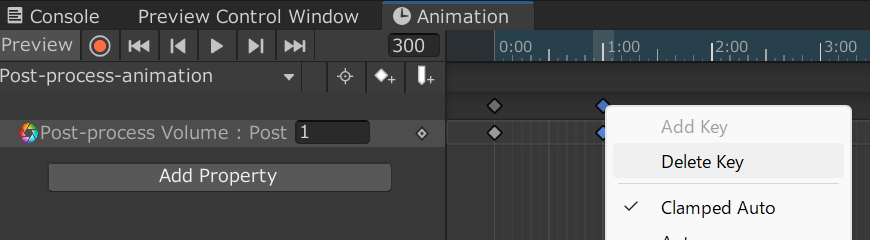

# 光がパァーってなってオブジェクトが出現するやつ

## 目次
* [完成イメージ](#完成イメージ)
* [下準備](#下準備)
* [作り方](#作り方)

## 完成イメージ

## 下準備
* PostProcessingのインポート

## 作り方
1. Post-process Volumeを作る

2. Post-process VolumeのProfileのところにあるNewボタンをクリックして、Post-process Volume Profileを作成する

3. Add effect...ボタンをクリックして、Unity→Bloomを追加する
4. Bloomの値をいい感じに設定する

   値とその内容(参考までにどぞ)
    * Intensity:明るさ(大きいほど明るくなる)
    * Threshold:輝度の閾値(小さいほどぼやけた感じになる)
    * Color:Bloomの色

      [※他のやつや詳しく知りたい人はここ見てみてね！](https://learn.unity.com/tutorial/posutopurosesuehuekuto-bloom?language=ja#)
5. Post-process VolumenのIs Globalにチェックを入れる
   ※Post-processの範囲を自分で決めたいよーって方は、チェックせずにコライダーでいい感じに調整してね！
6. Layerの21にPostProcessingの名前を付けて、Post-process VolumenのレイヤーをPostProcessing(Layer 21)にしてあげる

7. スイッチの作成
   適当なオブジェクト(今回はcubeでやります)にInteract Item TriggerとGlobal LogicのCCKスクリプトをつけてあげる 
  両者ともTargetの型をGlobalにし適当な名前(同一名)をつけてあげる 
  Interact Item TriggerのValueはSignalのままで！ 
  Global Logicで+ボタンを押して、以下の条件式を記述してあげる

8. Post-process VolumeにOn Create Item TriggerとSet Game Active GimmickのCCKスクリプトをつけてあげる (On Create Item Triggerはちゃんとコントローラーのオブジェクトを作って管理するのもいいかも) 
  両者ともTargetの型をGlobalにし適当な名前(同一名)をつけてあげる 
  On Create Item TriggerのValueはBoolにして、初期値はFalse(チェックなし)にしてあげる 

9. Animationを作成する
  

10. AnimationをPost-process Volumeにアタッチしてあげる
(Post-process VolumeというAnimation Controllerが自動で作成されるよ！)

11. Animationを開く(AnimationControllerの方じゃないよ)

12. Add PropertyをクリックしてPost-process VolumeのWeightを追加してあげる

13. フレーム数を300(5秒)にしてあげて、Add keyframe.(真ん中の◇+)のボタンをクリック

14. フレーム数を150(2.5秒)にしてあげて、Add keyframe.(真ん中の◇+)のボタンをクリック

15. フレーム数60(1秒)のkeyframeを右クリックDelete Keyで削除

16. こんな感じになればOK！

17. Previewの隣にある赤いボタンを押してから、フレーム数0と300のPost-process VolumeのWeightを0にしてあげる

18. こんな感じにアニメーションが動けばOK！

19. 出現させたいオブジェクトを作成(今回はSphereにするよ)
   そのオブジェクトに8で行ったように、On Create Item TriggerとSet Game Active GimmickのCCKスクリプトをつけてあげる 
  両者ともTargetの型をGlobalにし適当な名前(同一名)をつけてあげる 
  On Create Item TriggerのValueはBoolにして、初期値はFalse(チェックなし)にしてあげる 
  

20. スイッチにGlobal TimerとGlobal Logicを付け加えてあげる 
  両者とも型(Target)はGlobalにしてあげる
   Global TimerのKeyはスイッチのInteract Item Timerのやつと同じにする
   Delete Time Secondsは処理を遅延してほしい秒数(今回は3秒)にする
   +ボタンを押して処理を追加するTargetやValueはInteract Item Triggerの時と同様に定める
   Global Logicの方も初めに追加したGlobal Logicと同時に定める
   (※keyの名前は初めに作ったInteract Item TriggerやGlobal Logicと同じにしてはダメだよ)
  

21. スイッチにマテリアル切り替え機能やCanvas,Textを使ってアレンジを加える(お好みでどうぞ)

22. 完成！