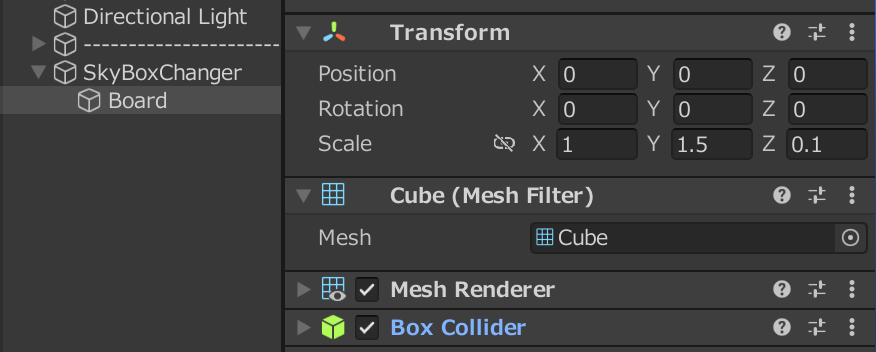

# SkyBoxをいい感じに切り替えれるスイッチ

## 目次
* [完成イメージ](#完成イメージ)
* [下準備](#下準備)
* [作り方](#作り方)

## 完成イメージ

## 下準備
* ほびわんぷらねっと様の「[【無料】ObjectSkyboxシェーダー](https://hobione.booth.pm/items/2972214)」をダウンロード
* 適当なSkyBoxのテクスチャをインポート(今回は、ai_works様の[【CC0】4K HDR SKYBOX for Unity 2019（24種類）](https://booth.pm/ja/items/3201726)を使用させていただきます)

## 作り方
1. 空のオブジェクトを作成(全ての機能を入れる箱みたいなものだよ) 
  

2. スイッチボードとスイッチを作成 
(今回は6つのSkyBoxを切り替えられるスイッチを作るよ)

3. スイッチを付けるボードを作成 
  (x:1.0, y:1.5, z:0.1のCubeを用意してね) 
  

4. スイッチのオブジェクトを作成 
  スイッチをまとめたものを入れるための空オブジェクトを作成してから、その子どもにCubeオブジェクト作成 
  

5. スイッチの機能を作成 
  スイッチにInteract Item Triggerを付けよう(トリガーのTargetとValueは以下のようにしてね) 
   

  スイッチにGlobal Timerを付けよう(Target,Key等は以下のようにしてね) 
  

6. 同様の手順でスイッチを6つに増やしてね 
  (スイッチの位置やTarget,Keyの名前のパターンに気を付けてね) 

  スイッチ2 
     
  
  スイッチ3 
     
  
  スイッチ4 
     
  
  スイッチ5 
     
  
  スイッチ6 
     

7. 各Itemのトリガーを管理するオブジェクトを作成 
  (空のオブジェクトを作成したら、On Create Item Triggerを付けて、TargetとValueを以下のようにしてね)
   

8. SkyBoxにあたるオブジェクトを作成 
  各SkyBoxオブジェクトを入れる空のオブジェクトを作成し、その子どもに大きさ100のSphereを作成(コライダーは削除する) 
  Set Game Object Active Gimmickを付けて、TargetをGlobal,KeyをSkyBox01にしよう 
   

9. SkyBoxオブジェクトを操作するAnimation Controllerを作成 (Projectのタブで右クリックCreate→Animation Controllerで作成できるよ) 

10. Animation ControllerをSkyBoxオブジェクトにアタッチ

11. Animationタブを開いて(Ctrl+6)、Create New ClipでSkyBoxオブジェクトがActivateにするAnimationクリップとDeactivateするAnimationクリップを作成 
   
   

12. AnimationクリップでAdd PropertyでMesh Renderer.Material._Opacityの項目を追加 
Activateするアニメーションでは、値の大きさを5秒かけて0から1にする 
Deactivateするアニメーションでは、値の大きさを5秒かけて1から0にする 

13. Animatorタブを開いて、先程の作ったAnimation Clipを以下の様に配置する 
   

14. SkyBoxOFFのパラメーターをTriggerで追加する 13でSkyBoxONステートからSkyBoxOFFステートに行くためのConditionをSkyBoxOFFトリガーにする 

15. SkyBoxオブジェクトにSet Animator Value Gimmickを付けて、以下の様に設定しよう 
   

16. 同様の手順でSkyBox02～SkyBox06を設定するオブジェクトを作成 (AnimatorやAnimationは使いまわしてOK) 

  SkyBox02 
   

  SkyBox03 
   

  SkyBox04 
   

  SkyBox05 
   

  SkyBox06 
   

17. 各SkyBoxオブジェクトに対応するSkyBoxのTextureをObjectSkyboxCube(ほびわん様のSharderを使用したマテリアル)のマテリアルを用いて貼る 
[ObjectSkyboxSharderの使い方](https://note.com/homura_cluster/n/n668499b6e4f8) 

18. スイッチに色を付けたり、押したら赤くなる様にしたりアレンジを加えて完成！ 